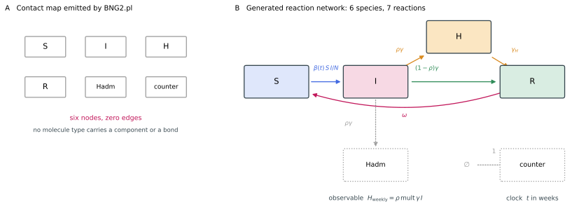
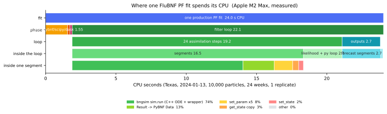
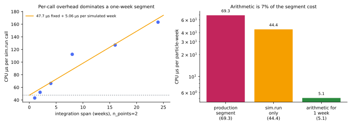
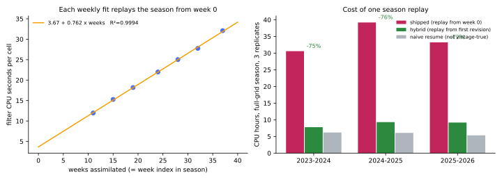
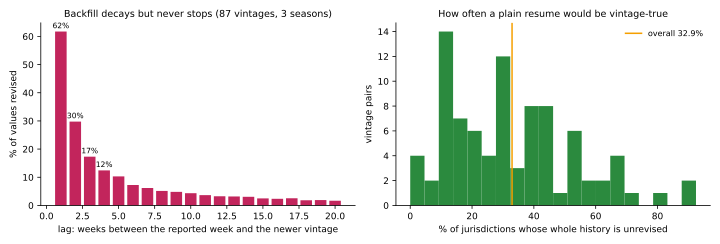
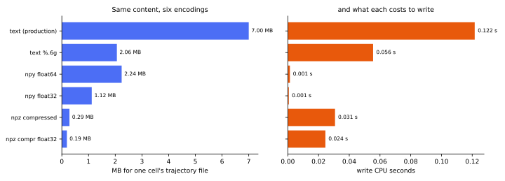

# Performance characterization of the FluBNF fitting pipeline

Ely F. Miller, Posner Lab, Northern Arizona University.
Measurements taken 2026-08-23 against FluBNF 1.0.0.

**Summary:** FluBNF fits a population-parameterized SIHRS compartmental model,
written in the BioNetGen language (BNGL), to weekly influenza hospital
admissions for the 53 locations of the CDC FluSight challenge, using a
sequential importance-resampling particle filter implemented in a fork of
PyBioNetFit and simulated in-process by bngsim. Here we characterize the cost
of that pipeline and evaluate five proposed optimizations against it. One
production fit of one jurisdiction at one forecast date costs 24.4 s of CPU on
an Apple M2 Max, of which the filter loop is 90.9% and the C++ ordinary
differential equation (ODE) integration itself is 26.6%. Two structural
redundancies account for most of the cost. First, network generation is
repeated per cell although the generated reaction network is invariant across
all 106 jurisdiction-season cells tested. Second, every weekly fit reassimilates
the season from week 0, so 95.6% of the assimilation work across three seasons
re-derives a particle cloud the previous week already computed. We demonstrate
a shared-network prototype that reproduces the production trajectories bitwise
in 14 of 14 cells, and we cost a vintage-aware checkpoint rule that removes 72%
to 76% of a season's CPU while remaining exactly vintage-true by construction.
We also report three negative results: `run_batch` in bngsim is 10.7 times
slower per simulation than the loop it would replace, thread parallelism across
particles is 0.69 to 0.78 times the speed of a single thread, and a persistent
cross-week worker pool would save 0.03% to 0.13% of a week's CPU.

**Availability and implementation:** FluBNF 1.0.0 is available at
https://github.com/elyfmiller/flubnf under the MIT license. The particle-filter
fork of PyBioNetFit is at https://github.com/lanl/PyBNF, branch
`feature/particle-filter`. FluBNF relies on BioNetGen
(https://bionetgen.org), version 2.9.2, for network generation, on bngsim
(https://github.com/lanl/bngsim), version 0.13.0, for in-process ODE
integration, and on PyBioNetFit for the fitting framework. Forecast targets,
truth vintages, and baseline forecasts come from the CDC FluSight forecast hub
(https://github.com/cdcepi/FluSight-forecast-hub).

**Contact:** richard.posner@nau.edu

**Supporting data:** The model provenance record, including every fixed value's
DOI or data derivation, is `docs/MODEL-PROVENANCE.md`. The validation record of
the shipped system is `docs/RELEASE-1.0.md`.

---

## 1 Introduction

Sequential Monte Carlo methods are attractive for real-time epidemic
forecasting because they condition on each new observation without refitting
from scratch, and because they carry a full predictive distribution rather than
a point estimate. FluBNF uses one such filter over a compartmental model
specified in the BioNetGen language, BNGL (Faeder et al., 2009), so that the
model definition, the likelihood, and the priors are the same objects the
group's other PyBioNetFit work uses (Mitra et al., 2019; Neumann et al., 2022;
Miller et al., 2026). Two elements are inherited from the group's earlier
epidemic work, in which a compartmental model of Coronavirus Disease 2019
transmission was fitted to regional case data by adaptive Markov chain Monte
Carlo sampling: a negative binomial treatment of surveillance noise, and the
practice of fixing every parameter that the data identify only in product form
(Miller et al., 2023). The forecasting record of the resulting system is
documented elsewhere: over three seasons replayed at full grid on point-in-time
data, the shipped two-member ensemble scored a pooled weighted interval score
of 0.704 relative to the CDC FluSight-baseline, and beat that baseline in every
season (`docs/RELEASE-1.0.md`).

The cost of that record is not documented anywhere, and it is not small. A
full-grid season replay of 32 archived vintages at three replicates occupies
roughly 30 CPU-hours, and the group's own independent replication of the
three-season record on a laptop took about 18 machine-hours. Compute has been
the binding constraint on every methodological question the project has asked,
because each candidate model change must be tested on the full grid before it
can be trusted; six-state panel results failed to transfer to the full grid on
two separate occasions (`docs/RELEASE-1.0.md`).

The objective of this study
is to measure where the CPU time of a FluBNF particle-filter fit actually goes,
to quantify the two structural redundancies we suspected in the pipeline, and
to evaluate five proposed optimizations, namely network-generation
amortization, batch integration, worker persistence, binary and summary output,
and vintage-aware checkpointing, against measured or bounded gains, so that the
ordering of any future optimization work is set by evidence rather than by
intuition. Where a candidate could be prototyped, we built it and
report both its measured gain and the equivalence check that establishes it
changes no result.

## 2 Materials and methods

### 2.1 The SIHRS model

The model tracks four compartments of people plus two bookkeeping species. The
compartments are susceptible ($S$), infectious ($I$), hospitalized ($H$), and
recovered or otherwise immune ($R$), all in absolute persons, and the
jurisdiction population $N$ enters as known data rather than as a
normalization. Infection is frequency-dependent, so the rate constant of the
`S() + I() -> I() + I()` rule is $\beta(t)/N$ and the flux is $\beta(t)SI/N$.
Writing $\gamma$ for the removal rate constant, $\rho$ for the true
infection-hospitalization branching fraction, $\gamma_H$ for the discharge rate
constant, and $\omega$ for the waning rate constant, the generated reaction
network is the system

$$
\begin{aligned}
\frac{dS}{dt} &= -\frac{\beta(t)\,S\,I}{N} + \omega R \\[3pt]
\frac{dI}{dt} &= \frac{\beta(t)\,S\,I}{N} - \gamma I \\[3pt]
\frac{dH}{dt} &= \rho\gamma I - \gamma_H H \\[3pt]
\frac{dR}{dt} &= (1-\rho)\gamma I + \gamma_H H - \omega R \\[3pt]
\frac{dA}{dt} &= \rho\gamma I
\end{aligned}
\qquad\qquad (1)
$$

In Equation 1, $A$ is a cumulative-admissions accumulator, written in the BNGL
template as the `Hadm()` species produced by the rule
`I() -> I() + Hadm()`, which counts the $I \to H$ flux without consuming $I$.
The accumulator exists because the engine's `neg_bin_dynamic` objective
differences any observable whose name ends in `_Cum` into weekly increments.

Transmission carries one annual harmonic. The seasonal transmission rate is

$$
\beta(t) = \beta_0 \exp\!\left[\varepsilon_1 \cos\!\left(\frac{2\pi (t - \varphi_1)}{52}\right)\right],
\qquad \beta_0 = \frac{R_{\mathrm{eff}}\,\gamma}{s_0},
\qquad (2)
$$

with $t$ in weeks from season start. The exponential form keeps $\beta > 0$ for
every parameter value in the prior box, and $\varphi_1$ is the week of peak
transmissibility, not the week of the epidemic peak. The initial condition is

$$
S(0) = N s_0, \quad I(0) = N i_0, \quad H(0) = 0, \quad R(0) = N(1 - s_0 - i_0), \quad A(0) = 0,
\qquad (3)
$$

so that $S + I + H + R = N$ exactly and pre-existing immunity is representable
as $s_0 < 1$.

We fit five parameters and fix the rest. The five adjustable parameters are
$R_{\mathrm{eff}}$, $\varepsilon_1$, $\varphi_1$, `mult`, and $r$, with priors
uniform on $[0.60, 2.50]$, $[0, 1.0]$, and $[0, 52]$ weeks respectively for the
first three, and log-uniform on $[0.002, 1.0]$ and $[0.1, 40.0]$ for the last
two. The fixed values are $\gamma = 2.1875$ per week (a 3.2-day mean intrinsic
generation time, Chan et al., 2024), $\rho = 0.02$, $\gamma_H = 1.17$ per week
(approximately a 6-day length of stay), $\omega = 0.019$ per week
(approximately a 1-year mean immune duration), and $s_0 = 0.85$. Two further
quantities, $N$ and $i_0$, are known data taken from the FluSight hub's
locations file and from the season's first observed week. Every fixed value's
DOI or data derivation is recorded in `flubnf/sihrs_priors.py` and in
`docs/MODEL-PROVENANCE.md`.

Four identifiability limits are stated here because they determine which
parameters are adjustable. First, the fitted quantity is the effective
reproduction number at season start, $R_{\mathrm{eff}}$, and not the basic
reproduction number: admissions identify $R_{\mathrm{eff}}$ through the growth
rate, and with $S(0) = N s_0$ the classic $R_0 = R_{\mathrm{eff}}/s_0$ is
recoverable only post hoc. Second, only the product $\rho \cdot$ `mult` is
identified by an admissions series, so we fix $\rho$ at the biological
branching fraction, which enters the reaction rules, and fit `mult` as
observation-side ascertainment, which never enters the reaction rules. Third,
$\gamma_H$ does not enter the fit target at all, because the target is the
admission flux and not the census $H(t)$, so $\gamma_H$ is unidentifiable here
and must stay fixed. Fourth, $R_0 s_0$ is product-identified, so freeing both
$R_{\mathrm{eff}}$ and $s_0$ would add a ridge rather than information, and
$s_0$ is fixed.

Figure 1 shows the model as BioNetGen sees it.

**Figure 1.** The SIHRS production model as BioNetGen sees it, generated from
`flubnf/templates/SIHRS_pop_min.bngl`. Panel A reproduces the contact map
emitted by `BNG2.pl` under `visualize({type=>"contactmap"})`: six nodes and
zero edges. The contact map is uninformative for this model, and that is a
property of the model rather than a failure of the tool, because a contact map
draws the components of molecule types and the bonds between them, and no
molecule type in this model carries a component or a bond. Panel B therefore
presents the generated reaction network read from the `.net` file. Boxes are
species, and arrows are reactions labeled with their rate laws. Solid boxes are
the four compartments of people, in absolute persons; dotted boxes are the two
bookkeeping species, the cumulative-admissions accumulator `Hadm` and the
`counter` clock that supplies the observable $t$ in weeks. The blue arrow is
the frequency-dependent infection flux $\beta(t)SI/N$, the orange arrows are
the hospitalization branch and discharge, the green arrow is direct recovery,
and the red arrow is waning immunity, the second S of SIHRS. The dotted grey
arrow into `Hadm` counts the $I \to H$ flux without consuming $I$. It should be
noted that network generation for this model is a one-to-one expansion: six
molecule types become six species and seven rules become seven reactions, with
no combinatorial expansion of any kind.

### 2.2 Data used in fitting

The fit target is the weekly count of reported influenza hospital admissions
for one jurisdiction, read from the point-in-time (vintage) truth file
published by the FluSight hub as of the forecast date. Each fit uses only weeks
at or before that date, so there is no leakage. A fit at forecast date
2024-01-13 with a season start of 2023-08-01 assimilates 24 weekly
observations. The observation inventory of one cell is a model-definition file
(`m.bngl`), a generated reaction network (`m.net`), one tabular data file
(`<jurisdiction>_flu.exp`), and one PyBioNetFit configuration file
(`pf.conf`).

### 2.3 Observation model and the sequential filter

The predicted observation for week $w$ is the ascertained weekly admission
increment of the accumulator,

$$
\mu_w(\theta) = \texttt{mult} \cdot \big[A(w) - A(w-1)\big]
= \texttt{mult} \cdot \rho\gamma \int_{w-1}^{w} I(u)\, du ,
\qquad (4)
$$

which is a flow and not a stock. Measurement noise is negative binomial with
per-particle dispersion $r$, so that $Y_w \sim \mathrm{NB}(r, p_w)$ with
$p_w = r/(r + \mu_w)$, mean $\mu_w$, and variance $\mu_w + \mu_w^2/r$. Written
as the log-probability mass function the filter actually evaluates, this is

$$
\log P(y_w \mid \theta) = \ln\Gamma(y_w + r) - \ln\Gamma(r) - \ln\Gamma(y_w + 1)
+ r \ln\!\frac{r}{r + \mu_w} + y_w \ln\!\frac{\mu_w}{r + \mu_w}.
\qquad (5)
$$

Equation 5 licenses overdispersion relative to a Poisson observation model, and
the dispersion is inferred jointly with the other four parameters rather than
specified in advance.

Inference is by a sequential importance-resampling particle filter of the
bootstrap family (Gordon et al., 1993), with the parameter vector carried
alongside the state. The filter maintains $P = 10{,}000$ particles, each a
triple of a parameter vector $\theta^i$, a species state $x^i$ carrying the
five quantities of Equation 1 together with the clock species, and a weight
$w^i$. Parameter vectors are drawn from the priors at week 0 and the species
state is set to Equation 3. At each weekly
observation the filter first jitters the parameters, then propagates each
particle by integrating Equation 1 over $[w-1, w]$ from that particle's own
injected state, then reweights by Equation 5,

$$
\tilde{w}^i_w \;\propto\; w^i_{w-1}\, P\!\left(y_w \mid \theta^i_w\right),
\qquad w^i_w = \frac{\tilde{w}^i_w}{\sum_{j=1}^{P} \tilde{w}^j_w}.
\qquad (6)
$$

Weights are accumulated in log space and shifted by their maximum before
exponentiation, which is the standard guard against underflow. Degeneracy is
monitored by the effective sample size, and the filter resamples when the
ensemble has collapsed,

$$
\mathrm{ESS}_w = \Big(\textstyle\sum_{i=1}^{P} (w^i_w)^2\Big)^{-1},
\qquad \text{resample if } \mathrm{ESS}_w < c\,P .
\qquad (7)
$$

In Equation 7 the threshold $c$ is the `pf_resample_threshold` setting, whose
value is 0.5 in every production fit. Resampling is systematic (Kitagawa,
1996), drawing one uniform $u$ and taking ancestor indices at cumulative-weight
positions $(u + j)/P$ for
$j = 0, \dots, P-1$, which has lower variance than multinomial resampling. Note
that the parameter vector, the species state, and the retained mean history are
all permuted by the same ancestor indices, so a particle's history travels with
it.

Parameter jitter follows the shrink-toward-mean form of Liu and West (2001).
With $h = 0.30$ and $a = \sqrt{1 - h^2}$, and with $\bar\theta_w$ and $s_w$ the
weight-weighted mean and standard deviation of the ensemble,

$$
\theta^i_w = a\,\theta^i_{w-1} + (1-a)\,\bar\theta_{w-1} + h\, s_{w-1} \odot z^i,
\qquad z^i \sim \mathcal{N}(0, \mathbf{I}),
\qquad (8)
$$

with the result clipped to the prior box. Equation 8 preserves the ensemble
variance rather than inflating it: naive additive noise would make the
parameter ensemble a random walk within a few weeks, whereas the measured
ensemble spread under Equation 8 is flat across a jitter sweep (0.227, 0.225,
and 0.220 at $h$ of 0.05, 0.25, and 0.50; `pybnf/pf.py`).

After the last assimilated week the filter resamples once to equal weights and
propagates a copy of the cloud forward four weeks, drawing
$y^i_{w+k} \sim \mathrm{NB}(r^i, \mu^i_{w+k})$ at each horizon so that
observation noise as well as parametric uncertainty enters the predictive
distribution. Each replicate's samples are then rescaled so that its median at
the forecast origin equals the last observed value, and the three replicates
are pooled. Anchoring fixes the origin by construction and leaves the forward
growth to the model.

### 2.4 Ensemble construction and evaluation

The shipped forecast is not the filter alone. Member quantile sets are combined
by vincentization, that is, by averaging quantiles rather than densities
(Genest, 1992). For members $m = 1, \dots, M$ with quantile functions
$Q_m$ and weights $\lambda_m$, the ensemble quantile at level $\tau$ is

$$
Q_{\mathrm{ens}}(\tau) = \sum_{m=1}^{M} \lambda_m\, Q_m(\tau),
\qquad \sum_{m=1}^{M}\lambda_m = 1,
\qquad \lambda_m = \tfrac{1}{M}.
\qquad (9)
$$

The weights in Equation 9 are equal and were never fitted. Fitted
leave-one-season-out weights scored worse than the fixed equal weights over the
three-season record (0.732 against 0.704), which is why version 1.0 ships
$\lambda_m = 1/M$ (`docs/RELEASE-1.0.md`).

Forecast skill is scored by the weighted interval score (Bracher et al., 2021),
which approximates the continuous ranked probability score for a quantile
forecast. For a central $(1 - \alpha)$ prediction interval with lower and upper
bounds $l$ and $u$, the interval score is

$$
\mathrm{IS}_\alpha(F, y) = (u - l)
+ \frac{2}{\alpha}(l - y)\,\mathbf{1}\{y < l\}
+ \frac{2}{\alpha}(y - u)\,\mathbf{1}\{y > u\},
\qquad (10)
$$

and the weighted interval score over $K$ nested intervals with median $m$ is

$$
\mathrm{WIS}(F, y) = \frac{1}{K + \tfrac{1}{2}}
\left[ \tfrac{1}{2}\,|y - m| + \sum_{k=1}^{K} \frac{\alpha_k}{2}\,\mathrm{IS}_{\alpha_k}(F, y) \right].
\qquad (11)
$$

For the 23 FluSight quantile levels, $K = 11$ and $\alpha_k = 2 q_k$ for
$q_k$ in $\{0.01, 0.025, 0.05, 0.10, \dots, 0.45\}$. Equation 11 decomposes
additively into a dispersion term, an overprediction term, and an
underprediction term, which is how the project's error decomposition reads it.
Results are reported relative to the CDC FluSight-baseline over a common set of
scored cells,

$$
\mathrm{relWIS} = \frac{\sum_c \mathrm{WIS}_c(\text{model})}{\sum_c \mathrm{WIS}_c(\text{baseline})},
\qquad (12)
$$

so that a value below 1.000 beats the baseline. No forecast skill was measured
in the present study; Equation 12 is stated because it defines the quantity
that any optimization must leave unchanged.

### 2.5 Computational architecture

A **cell** is the unit of work: one (jurisdiction, forecast date, replicate)
triple, with its own directory, its own deterministic seed, taken as the first
four bytes of `sha256("<location>|<forecast_date>|<replicate>")` read
little-endian and reduced modulo $2^{31} - 1$, its own materialized `m.bngl`,
its own generated `m.net`, its own `.exp` data file, and its own `pf.conf`.
The production `RunSpec` defaults are `engine=pf`, `particles=10000`,
`replicates=3`, `jitter=0.30`,
`observable_mode=integrated`, `pf_forecast_weeks=4`, `population_size=1`, and
`objfunc=neg_bin_dynamic` (`app/core/runs.py`). The FluSight
location set has 53 entries, the 50 states, the District of Columbia, Puerto
Rico, and the US national aggregate, so one forecast date at full grid
materializes 53 locations times 3 replicates, that is, 159 cells, and a
32-vintage season replay materializes 5,088.

The pipeline runs across two Python environments that are not interchangeable.
Materialization and scoring run in the analysis environment (CPython 3.12.7),
and the filter runs in the engine environment (CPython 3.10.16), which carries
the PyBioNetFit fork and bngsim. `prepare()` resolves each jurisdiction once,
writes the model and data files, invokes `perl BNG2.pl m.bngl` (BioNetGen,
Harris et al., 2016) to produce
`m.net`, and writes `pf.conf`. `execute()` writes a generated runner script to
the workroot and starts one engine-environment interpreter, which loops over
every cell in its shard inside one process; module imports are therefore paid
once per runner process rather than once per cell. The retrospective path
shards the week's cells across `width` runner processes, default 4
(`app/core/retro.py`). Inside the runner, each cell calls `load_config`, which
spawns `BNG2.pl -v` as a version probe, then constructs `ParticleFilter`, whose
inherited initializer spawns `BNG2.pl m_gen_net.bngl` into `out/Initialize/`
and loads that second network with bngsim, which wraps the CVODE solver of the
SUNDIALS package (Hindmarsh et al., 2005) and which in turn compiles a shared
library with `cc -O3` if its codegen cache misses. Finally `run()` performs the
assimilation steps, the four-week forecast, and the output writes. Back in the
analysis environment, `collect()` reads the trajectory files with
`np.genfromtxt` and pools the replicates.

### 2.6 Measurement protocol and study bias

All timings were taken on one Apple M2 Max with 12 physical and 12 logical
cores and 103.1 GB of memory, running macOS 26.5.1 build 25F80 on arm64. The
software under test was FluBNF at commit `7892511` (version 1.0.0), the
PyBioNetFit fork at commit `eab31c71` on branch `feature/particle-filter`,
bngsim version 0.13.0, BioNetGen version 2.9.2, and numpy 2.2.6, scipy 1.15.3,
and pandas 2.3.3 in the engine environment. The reference cells were California
and Texas at forecast date 2024-01-13 with a season start of 2023-08-01, that
is, 24 assimilated weeks, at one and at three replicates. A season scan
additionally used seven forecast dates from 2023-10-14 to 2024-04-13.

Measurement bias is a concern because the host was not idle. Throughout the
measurement window the machine carried ten unrelated CPU-bound processes
belonging to sibling sessions, plus one further analysis job and a system
`FSEvents` process at 99% CPU, and the one-minute load average ranged from
14.4 to 24.4 on 12 cores, sampled beside every timing. We did not stop the
sibling jobs, because they are another session's work on a shared machine. To
account for the resulting bias we report CPU time as the primary quantity
throughout, measured with `time.process_time` for the process itself and with
`resource.getrusage(RUSAGE_CHILDREN)` for subprocesses, both of which are
robust to scheduling contention to first order. Wall-clock time is reported
beside CPU time, with the load average, as the honest record of what was
observed. Consequently the wall-clock figures in this document are inflated and
are not a clean characterization of the pipeline on an idle machine. The
distinction matters most at module import, where CPU time is 1.1 s and wall
time ranged from 3.6 s to 39.2 s.

One measurement could not be taken. A sampled flame graph would have been the
natural primary artifact, and `py-spy` version 0.4.2 was installed for that
purpose, but it refuses to sample on macOS without root and this session had no
route to `sudo`. We substituted deterministic `cProfile` attribution and a
hierarchical CPU-time icicle chart, which carries the same information built
from CPU time rather than from sampled wall time.

## 3 Results

### 3.1 Where the CPU time of one fit goes

Figure 2 shows the CPU decomposition of one production fit, and Table 1 gives
the same decomposition numerically. The filter loop is 90.9% of the cell, and
everything that happens before it, including all three `BNG2.pl` invocations,
the codegen compile, and the entire module import, is 9.1%.

**Figure 2.** Where one production particle-filter fit spends its CPU time, for
Texas at forecast date 2024-01-13, 10,000 particles, 24 assimilated weeks, and
one replicate. Each row is one level of the call hierarchy and each bar's width
is CPU seconds, so a row's children sum to their parent. The top row is the
whole fit at 24.0 s of CPU. The second row splits it into module import
(1.55 s), the subprocess and setup phases, and the filter loop (22.1 s). The
third row splits the filter loop into the 24 assimilation steps (19.2 s) and
the output and forecast phase (2.7 s). The fourth row splits the assimilation
steps into segment integration (16.5 s) and the likelihood evaluation with its
per-particle Python (2.7 s), and shows the forecast segments (2.7 s) beside
them. The bottom row decomposes one integration segment into the five measured
components named in the legend, plus a residual. Bars narrower than the axis
resolution, including the Liu-West jitter at 0.025 s and systematic resampling
at 0.005 s, are present but not legible at this scale. It should be noted that
this is a CPU-time icicle chart and not a sampled flame graph; `py-spy` requires
root on macOS and could not be run.

**Table 1.** CPU decomposition of one production fit.

| phase | self CPU (s) | child CPU (s) | total CPU (s) | % of cell |
|---|---:|---:|---:|---:|
| prepare: materialize, `write_exp`, `resolve_state` | 0.040 | 0 | 0.040 | 0.2% |
| prepare: `BNG2.pl m.bngl` | 0 | 0.159 | 0.159 | 0.7% |
| process start (`python -c pass`) | 0.010 | 0 | 0.010 | 0.0% |
| import `pybnf`, `scipy`, `dask/distributed`, `numpy` | 1.552 | 0 | 1.552 | 6.4% |
| `load_config` own work | 0.073 | 0 | 0.073 | 0.3% |
| `load_config` to `BNG2.pl -v` | 0 | 0.116 | 0.116 | 0.5% |
| `ParticleFilter()` own work | 0.013 | 0 | 0.013 | 0.1% |
| `ParticleFilter()` to `BNG2.pl m_gen_net.bngl` | 0 | 0.133 | 0.133 | 0.5% |
| codegen `cc -O3` compile, cold cache only | 0.006 | 0.120 | 0.126 | 0.5% |
| filter loop | 22.140 | 0 | 22.140 | 90.9% |
| **total** | 23.834 | 0.528 | **24.362** | 100% |

Texas, forecast date 2024-01-13, 10,000 particles, 24 assimilated weeks, one
replicate. Self CPU is `time.process_time`; child CPU is
`resource.getrusage(RUSAGE_CHILDREN)`. The codegen compile is paid once per
distinct network content, not once per cell. Source: `work/tx_cell0_fine.json`,
the `prepare` timings under `work/tx_prep/wr0`, and the netgen median over 106
calls in `work/netgen/netgen_hash.json`.

Inside the filter loop, the 24 assimilation steps are 19.204 s (78.8% of the
cell) and the output serialization plus the four-week forecast propagation is
2.708 s (11.1%). The two operations a reader might expect to be expensive are
not: the Liu-West jitter of Equation 8 costs 0.025 s over 24 vectorized calls
(0.10% of the cell) and systematic resampling costs 0.005 s (0.02%). Segment
integration is 16.45 s (67.5%) and the likelihood evaluation plus the
per-particle Python around it is 2.75 s (11.3%). The segment figure is the one
pro-rated number in this study: `simulate_segment` was timed as a whole
(19.196 s over 280,000 calls) and split between the 240,000 assimilation calls
and the 40,000 forecast calls by count, which is sound to within a few percent
because both populations do the same work, and which the directly measured
`_write_outputs` total of 2.708 s bounds independently.

Deterministic profiling agrees on the ranking. On a 30.088 s profiled run of
the shipped runner body the largest single entry is
`bngsim/_simulator.py:2659 _run_ode_with_jacobian_fallback` at 7.994 s of
exclusive time over 280,000 calls, which is 26.6% of the profiled fit. The
actual C++ ODE integration is therefore about a quarter of the work, and the
remainder is wrapper machinery around 280,000 very small calls: 4,789,350
`getattr` calls, 2,220,599 `hasattr` calls, 1,400,000 `set_param` calls, and
560,003 `logging.Logger.info` calls per fit.

End to end through the shipped entry points, at three replicates for
California and at a load average of 17.1 to 18.3, `prepare()` took 3.08 s wall,
`execute()` took 73.67 s wall and 64.37 s of child CPU, and `collect()` took
0.42 s wall, for a total of 77.17 s wall and 64.86 s CPU, leaving a 26.0 MB
workroot with all three cells `ok`. Scaling to a full-grid week of 159 cells at
the same 24-week depth gives 3,462 s of CPU, that is, 57.7 CPU-minutes per
week. At the default shard width of 4 the wall floor on free cores is about
14.5 minutes.

### 3.2 Per-call overhead dominates one integration segment

Figure 3 shows the decomposition of one particle-week. Varying the integration
span while holding everything else fixed separates the marginal cost of
integration from the cost paid once per call. A least-squares fit over spans of
1, 2, 4, 8, 16, and 24 weeks gives 47.7 microseconds fixed plus 5.06
microseconds per simulated week, and the two-point estimate from the 1-week and
24-week samples agrees at 5.22 microseconds per week. We take the marginal cost
as 5.1 microseconds per simulated week.

**Figure 3.** Per-call overhead against integration arithmetic in one particle
segment. The left panel plots measured CPU microseconds per `sim.run` call
against the integration span in weeks at `n_points=2`, with blue markers for
the six measured spans and the orange line the least-squares fit, 47.7
microseconds fixed plus 5.06 microseconds per simulated week; the dotted grey
horizontal line marks the fitted intercept. The slope is the marginal cost of
integration and the intercept is everything paid once per call. The right panel
compares, on a logarithmic scale, the full production segment at 69.3
microseconds, the `sim.run` call alone at 44.4, and the arithmetic for one
simulated week at 5.1, so that integration arithmetic is 7% of what a
particle-week costs. It should be noted that of the 64.2 microseconds of
overhead, approximately 40 are Python and approximately 24 are C-side CVODE
re-initialization, which no reorganization of the Python layer can remove.

Against a production segment of 69.3 microseconds, measured directly as the
full `simulate_segment` body plus `_result_to_data`, one particle-week splits
three ways: approximately 40 microseconds (58%) of Python wrapper machinery,
approximately 24 microseconds (35%) of C-side per-call solver setup, and 5.1
microseconds (7%) of integration arithmetic. The Python and C split is anchored
by `cProfile`, which puts the C entry point at 28.6 microseconds per call
against an uninstrumented segment of 68.6 microseconds. Table 2 gives the
individually measured components.

**Table 2.** Measured cost of one integration segment and its components.

| component | CPU (microseconds) |
|---|---:|
| full `simulate_segment` plus `_result_to_data` (production) | 69.34 |
| `simulate_segment` body without `_result_to_data` | 57.82 |
| `sim.run` alone, `n_points=8` | 44.44 |
| `set_state` plus `sim.run`, `n_points=2` | 43.58 |
| `_result_to_data` alone | 8.75 |
| `set_param` five times | 2.39 |
| `get_state` copy | 0.60 |
| `set_state` | 0.52 |

Measured on the production network for a one-week span. Source:
`work/batch_bench.json`. It should be noted that the `n_points` reduction is
free of accuracy cost: comparing the segment end state at `n_points=8` against
`n_points=2` gives a maximum relative difference of 3.5e-15, and an `n_points`
scan at one week (54.6, 54.9, 44.0, 44.8, and 56.1 microseconds at 2, 4, 8, 16,
and 32) is noise-dominated on this contended machine and shows no measurable
dependence. The eight interior output rows the filter computes and discards are
therefore cheap; the cost is in converting them to a PyBioNetFit `Data` object,
which is 8.75 microseconds.

Two specific defects were found while measuring. First,
`pybnf/pf.py:479` places `from scipy.special import gammaln` inside the
per-particle loop, so it executes 240,000 times per 24-week fit; a cached
import statement costs 2.575 microseconds by `timeit`, which is 0.618 s per
fit, 2.6% of the cell's CPU, and roughly 98 CPU-seconds per full-grid week,
from one misplaced line. Second, `bngsim_model.py:782` iterates
`dict(params).items()` on a dictionary that is already a dictionary, allocating
a copy per segment, and wraps each `set_param` in a `try/except`.

### 3.3 The generated reaction network is invariant across the grid

Three separate `BNG2.pl` invocations happen per cell, and the network produced
by the first one is never read. `prepare()` runs `perl BNG2.pl m.bngl` and
writes `m.net`, whose only consumer anywhere in the tree is an existence check
at `app/core/engines/pf.py:163`; `load_config` runs `BNG2.pl -v` as a version
probe; and `ParticleFilter.__init__` runs `BNG2.pl m_gen_net.bngl` into
`out/Initialize/`, and that third network is the one bngsim loads. The two
generated networks were compared directly, and their `reactions` blocks are
identical while the whole files differ only in the ordering of two parameter
lines.

We materialized the production template for every one of the 53 FluSight
jurisdictions in each of two seasons, using the mid-season vintages 2024-01-13
and 2025-01-25, ran `perl BNG2.pl m.bngl` exactly as `prepare()` does, and
hashed the structural blocks of the resulting network. Across all 106 cells,
with zero failures, the `reactions` block, the `groups` block, the `functions`
block, the species names, and the parameter names each took exactly one
distinct md5 value, while the whole-file hash took 106 distinct values because
the parameter values differ. The invariant `reactions` block hashes to
`fea25383e643551d9b221c103f8b76ab` under the convention that includes the block
delimiters. This is structural rather than fortunate: every per-jurisdiction
quantity enters as a `parameter` and the species initial values are constant
expressions over them, and of those parameters only $N$ and $i_0$ actually vary
between jurisdictions, while $\gamma$, $\rho$, $\gamma_H$, $\omega$, and $s_0$
were identical in all 106 cells.

A fourth, less visible redundancy follows from the same fact. The bngsim
codegen cache key is the SHA-256 of a version tag concatenated with the full
network bytes (`bngsim/_codegen.py:4196`), so two cells that differ only in $N$
are different cache keys and each triggers a fresh `cc -O3 -shared` compile.
The cache on this machine holds 24,983 shared libraries occupying 878 MB, which
is the accumulated residue of that policy.

We built the alternative and checked it for equivalence.
`work/netgen_proto.py` generates the network once, loads it with
`bngsim.Model.from_net`, substitutes the seven per-jurisdiction constants with
`set_param`, re-derives the species initial concentrations from the network's
own initializer expressions, and calls `save_concentrations()` and `reset()`.
The shipped path and the prototype were compared on the initial state vector,
on a full 48-week production trajectory across all observables, and on a chain
of 24 particle-filter-style `set_state`, `run`, and `get_state` segments. In 14
of 14 cells all three comparisons were bitwise equal, and the worst relative
difference across every comparison was 0.000e+00. The 14 cells span two seasons
and the jurisdictions California, Texas, Ohio, Wyoming, Florida, New York,
Vermont, Puerto Rico, Alaska, and Georgia, including the smallest and largest
populations in the panel.

Table 3 costs the redundancy per full-grid week. Against a week costing
3,462 s of CPU end to end, eliminating it removes 2.1% of the week's CPU. It is
a real saving and it carries no numerical risk, but it is not the headline.

**Table 3.** Redundant subprocess work per full-grid week of 159 cells.

| item | count per week | CPU saved (s) | wall saved (s) |
|---|---:|---:|---:|
| `BNG2.pl m.bngl` in `prepare()` | 159 | 25.3 | 99.2 |
| `BNG2.pl -v` in `load_config` | 159 | 18.4 | 20.8 |
| `BNG2.pl m_gen_net.bngl` in PyBioNetFit | 159 | 21.1 | 33.9 |
| cold codegen compiles | 53 | 6.7 | 19.8 |
| **total** | | **71.5** | **173.7** |

Counts assume 53 distinct network contents per week, because the three
replicates of one jurisdiction share a network. Per-call costs were measured
as 0.159 s of CPU and 0.624 s of wall time (median over 106 calls, range 0.267
to 1.672 s) for `BNG2.pl m.bngl`, 0.116 s and 0.131 s for `BNG2.pl -v`, 0.133 s
and 0.213 s for `BNG2.pl m_gen_net.bngl`, and 0.126 s of CPU for a cold codegen
compile against 0.000115 s for a warm cache probe. It should be noted that the
wall column is inflated by host contention, as stated in section 2.6.

### 3.4 The season is quadratic

The PyBioNetFit fork supports resumption. Setting `pf_continue` together with
`pf_state_file` loads a saved cloud and skips every observation at or before
its last assimilated time, and the checkpoint is already written at the end of
replicate 0. FluBNF never uses it: neither the conf template in
`app/core/engines/pf.py` nor the retrospective path writes either key, so
`continue_run` is false in every production fit and the filter samples a fresh
prior every time. Every weekly fit therefore replays the whole season from
week 0.

The left panel of Figure 4 shows the consequence. Over seven forecast dates in
the 2023-24 season at one replicate and 10,000 particles, filter CPU is
perfectly linear in the number of assimilated weeks,

$$
\text{CPU (s)} = 3.67 + 0.762 \times (\text{weeks assimilated}),
\qquad R^2 = 0.9994,
\qquad (13)
$$

which makes the season sum quadratic. In Equation 13 the intercept is the
four-week forecast plus the once-per-process setup, and the slope, 0.762 s per
assimilated week per 10,000-particle cell, is the part that is re-derived every
week.

Counting every archived vintage in each season and every jurisdiction present
in it at three replicates, the 2023-24 season assimilates 39,856 week-cells of
which only 2,067 are new, so 94.8% of that season's assimilation work
re-derives something the previous week already computed. Across the three
seasons, 138,412 week-cells are assimilated and 6,126 of them are new, that is,
95.6% redundant, at a shipped cost of 30.6, 39.2, and 33.2 CPU-hours for
2023-24, 2024-25, and 2025-26 respectively.

**Figure 4.** The season is quadratic, and a vintage-aware checkpoint removes
most of it. The left panel plots measured filter CPU seconds per cell against
the number of assimilated weeks for California at one replicate and 10,000
particles, over seven forecast dates from 2023-10-14 to 2024-04-13; blue
markers are the measurements and the orange line is the least-squares fit of
Equation 13, 3.67 plus 0.762 times the number of weeks, with $R^2 = 0.9994$.
Linearity in week index makes the season sum quadratic. The right panel gives
the CPU-hours of one full-grid season replay at three replicates under three
policies: the shipped policy of replaying from week 0 in crimson, the hybrid
rule of replaying from the first revised week in green, and an unconditional
resume from the previous week in grey, with the hybrid saving annotated above
the green bar of each group. It should be noted that the grey bars are a lower
bound and not a
recommendation: an unconditional resume would be vintage-dishonest in 67.1% of
cases, as Figure 5 shows.

### 3.5 Vintage revisions bound how much of that can be reclaimed

Resuming is only honest if the new vintage has not revised anything the old fit
already assimilated. Figure 5 shows the measurement, taken over every
consecutive pair of the 87 archived hospital-admission vintages, comparing
716,452 location-week observations. The overall revision rate between
consecutive vintages is 1.60%, that is, 11,434 of 716,452. By lag, where lag is
the number of weeks between the reported week and the newer vintage's as-of
date, 61.7% of the 3,763 observations at lag 1 are revised, 29.8% at lag 2,
17.3% at lag 3, 12.4% at lag 4, 7.2% at lag 6, 5.1% at lag 8, 3.2% at lag 12,
and 3.0% at lag 14. Backfill decays sharply but never stops, partly through
whole-file reissues that touch the entire history at once.

**Figure 5.** Backfill in the archived hospital-admission vintages, measured
over every consecutive pair of the 87 archived vintages and 716,452
location-week observations. The left panel gives the percentage of values
revised as a function of lag, where lag is the number of weeks between the
reported week and the newer vintage's as-of date; the first four bars are
labeled with their values. Revision decays sharply from 61.7% at lag 1 to 12.4%
at lag 4, and then never stops, standing at 3.0% at lag 14, partly through
whole-file reissues that touch the entire history at once. The right panel is
the histogram over vintage pairs of the percentage of jurisdictions whose
entire assimilated history is unrevised, with the orange vertical line at the
overall value of 32.9%. That is the fraction of cases in which an unconditional
resume would be vintage-true. It should be noted that the operational test is
stricter than the average revision rate of 1.60%, because a checkpoint is
reusable only if every week the previous fit assimilated is unrevised.

The operational test is stricter than the average rate, because a checkpoint is
reusable only if the fit's entire assimilated history is unrevised. Measured
per pair of vintage and jurisdiction, only 32.9% of cases, that is, 1,519 of
4,611, would permit an unconditional resume. A naive policy of always resuming
from last week would therefore be silently vintage-dishonest in two cases out
of three.

The rule that is both fast and vintage-true keeps a checkpoint of the particle
cloud after every assimilated week rather than only the last one. At week $w$
it compares the new vintage against the one used at week $w-1$ over the weeks
the previous fit assimilated, takes $r$ to be the index of the earliest week
whose value changed or that is newly present, loads the checkpoint saved after
week $r-1$, and assimilates weeks $r$ onward. If nothing changed then $r = w$
and only the new week is assimilated; if the vintage was reissued wholesale
then $r = 0$ and the fit replays from season start, exactly as today. The rule
is exactly vintage-true by construction, because the cloud at week $r-1$ is a
deterministic function of the observations $0, \dots, r-1$ and those
observations are byte-identical in both vintages. Two conditions must hold and
both are satisfiable in the fork as it stands: the seeded random-number streams
must be replayed to the same point, so the cloud file must carry the generator
state alongside the parameters, species, weights, and last time, and the
checkpoint must record which vintage produced it.

The right panel of Figure 4 costs the three policies. The hybrid rule costs
1.3 to 1.7 times the total CPU of a dishonest resume and still removes roughly
three quarters of the season's CPU, as Table 4 shows. It is the largest
measured win in this study.

**Table 4.** Cost of three resume policies, full-grid season at three
replicates.

| season | shipped (CPU h) | hybrid (CPU h) | naive resume (CPU h) | hybrid saving | median weeks replayed | 90th percentile |
|---|---:|---:|---:|---:|---:|---:|
| 2023-24 | 30.59 | 7.78 | 6.18 | 74.6% | 2 | 4 |
| 2024-25 | 39.20 | 9.29 | 6.07 | 76.3% | 2 | 10 |
| 2025-26 | 33.23 | 9.16 | 5.34 | 72.4% | 3 | 12 |

Computed from the measured 0.775 s per assimilated week per cell and the
measured 3.43 s of fixed cost per cell, applied to every archived vintage and
every jurisdiction present in it. The slope used here was fitted before the
seven-point scan of Equation 13 and agrees with 0.762 to 1.7%. The naive column
is stated only as a lower bound and is not a policy we recommend, because it is
vintage-dishonest in 67.1% of cases. Source: `work/hybrid_resume.json`.

The storage cost of the rule is one checkpoint per assimilated week rather than
one per fit. The checkpoint file is 396 KB today, so a 24-week fit would write
9.5 MB, which is more than the 8.25 MB of trajectory and parameter text the
same fit already writes and never reads back. Section 3.6 removes that text.

### 3.6 Most of what a fit writes is never read

One finished cell writes 8,681,050 bytes, of which the trajectory file is
7,000,000 and the parameter file is 1,250,052. At 159 cells that is 1.38 GB per
full-grid week and 44.2 GB per 32-vintage season replay before the storage
reclaim prunes the cell trees. Very little of it is consumed. The trajectory
file holds 280,000 values and `collect()` reads 50,000 of them, that is, five
columns of twenty-eight, or 17.9%; the columns before the forecast origin, the
filtered history, are never read by anything in the tree. The parameter file
holds 50,000 values and its only consumer in the production path reduces each
file to one median per parameter for the model diagram, that is, 0.01%. The
`pf_state.npz` checkpoint holds 395,705 bytes and is read back only when
`pf_continue` is set, which nothing in FluBNF sets, so every byte of it is
currently dead. It is also, by section 3.5, the one artifact worth keeping.

Figure 6 shows the format benchmark on identical content. Encoding the
10,000 by 28 trajectory as text at `%.18e`, which is what production does,
costs 7,000,000 bytes and 0.122 s of write CPU. The same array as a float64
`.npy` file is 2,240,128 bytes and 0.001 s, as a float32 `.npy` file 1,120,128
bytes and 0.001 s, and as a deflate-compressed float32 archive 188,935 bytes
and 0.024 s, that is, 37.1 times smaller than production. On the read side,
`np.genfromtxt`, which is what `collect()` calls today, costs 0.1213 s of CPU
against 0.0005 s for `np.load` on identical content, a factor of 240; across a
159-cell week the read side alone is 19.3 s of CPU today against 0.08 s.

**Figure 6.** Six encodings of one cell's trajectory array, 10,000 by 28
float64, and what each costs to write. The left panel gives the size in
megabytes and the right panel the write CPU seconds, medians of three, with
each bar labeled with its value. The top bar in each panel is the production
encoding, text at `%.18e`. Compressed float32 is 37.1 times smaller than
production and costs one fifth of the write CPU, while an uncompressed float32
`.npy` file is 6.3 times smaller and costs 0.001 s. It should be noted that the
production encoding is also the slowest to read: `np.genfromtxt`, which is what
`collect()` calls today, costs 0.1213 s of CPU against 0.0005 s for `np.load`
on identical content, a factor of 240. It should also be noted that the
production array is larger than it needs to be in a second way, independent of
encoding, because `collect()` reads five of its twenty-eight columns and never
reads the filtered history at all.

The measured verdict on what to store is sharper than "summaries plus a
subsample". A 500-path subsample of all 28 columns is 112,128 bytes but its
worst quantile error against the full ensemble is 23.5%, with a median of 1.4%,
which is far too large near the tails that Equation 11 scores. Keeping every
particle but only the five columns that are read, in float32, is 200,128 bytes,
which is 41.2 times smaller than the trajectory and parameter text together and
numerically exact for everything `collect()` does. Adding the 23 parameter
quantiles for the model diagram costs another kilobyte and retires the
parameter file entirely. Combined, the change takes a full-grid week from
1.38 GB to about 38 MB, a factor of 36, write CPU from 23.9 s to about 0.3 s,
and read CPU from 19.3 s to 0.08 s.

### 3.7 Three candidates that do not work

Worker persistence was prototyped and rejected. Running three Texas cells in
one interpreter took 70.93 s wall and 64.03 s CPU, against 95.32 s wall and
66.88 s CPU in three interpreters, a saving of 24.39 s wall (25.6%) and 2.85 s
CPU (4.3%), or 0.95 s of CPU and 8.1 s of wall per fit. The saving is real and
the shipped runner already collects it, because both the forecast runner and
the retrospective runner loop over every cell in their shard inside one
interpreter and Python's module cache makes only the first import expensive.
The import is therefore paid once per runner process, that is, once per week on
the forecast path and `width` times per week on the retrospective path. Against
3,462 s of CPU per week, a cross-week persistent worker pool would save 0.03%
to 0.13% of the week's CPU, and over a 32-week season replay at width 4 about
141 s out of 110,000 s. The quantity that looked in the profile like a large
per-fit startup charge, the `Simulator.__init__` call that imports sympy to
build an analytical Jacobian, was measured to be a once-per-process cost of
0.255 s of CPU on the first cell and 0.003 to 0.006 s on every subsequent cell
in the same process. This optimization is not worth doing on its own.

Batch integration through the existing bngsim API does not work either, for two
independent reasons. First, bngsim exposes three batch entry points, `run_batch`,
`run_replicates`, and `steady_state_batch`, and none of them has the required
semantics: `run_batch` clones the model, sets the parameter set, and calls
`reset()` for every point, so it restores species to their initial conditions
and offers no argument for a per-simulation initial state, which makes it a
parameter scan rather than a particle propagator; `run_replicates` rejects
`method="ode"`; and `steady_state_batch` solves for fixed points rather than
trajectories. Second, `run_batch` is slower anyway. Measured on the production
network over a one-week span, the sequential `set_state` and `run` path costs
43.6 microseconds of CPU per simulation, against 507.9 at $P = 100$, 488.2 at
$P = 1{,}000$, and 465.6 at $P = 10{,}000$, that is, 10.7 times slower, and
adding threads makes it worse still (891.5, 956.7, and 948.6 microseconds at 4,
8, and 12 processors). The batch win, if there is one, must come from a new
vectorized entry point rather than from an existing one.

Thread parallelism across particles was prototyped and is slower than one
thread. The GIL is released inside the bngsim C++ `run`, so a thread pool over
per-thread model clones is the cheapest available parallel prototype. Over one
full 10,000-particle assimilation week it took 0.73 s of wall time at 1 thread,
0.93 s at 2, 1.05 s at 4, 1.00 s at 6, 1.05 s at 8, and 1.06 s at 12, that is,
0.69 to 0.78 times the single-thread speed. Two causes are present and we can
separate them only partially. The machine was at load 14 to 19 on 12 cores, so
there were no free cores to win, and that confounds the measurement. The
Amdahl ceiling, however, is independent of load and follows from section 3.2:
only 28.6 microseconds of the 68.6-microsecond segment is GIL-free, so even on
an idle machine thread speedup is capped at $1/(1 - 0.42) = 1.7$ before any
lock contention. Process-level parallelism across cells, which the
retrospective path already has at width 4, is the parallelism that works here.

### 3.8 The candidates, ranked

Table 5 states each candidate with its mechanism, its measured or bounded gain,
its risk to correctness, and the validation that would establish it. Gains are
quoted against a full-grid week of 159 cells at 24-week depth, measured at
3,462 s of CPU end to end and 3,612 s summed from Table 1, and against a
32-vintage season replay of the 2023-24 season at 30.59 CPU-hours.

**Table 5.** Candidate optimizations, ranked by measured or bounded gain.

| # | change and mechanism | measured or bounded gain | evidence | risk to correctness and the validation required |
|---|---|---|---|---|
| 1 | Per-week checkpoint plus the hybrid resume rule (section 3.5): write the cloud after every assimilated week and replay only from the first revised week | 72% to 76% of season CPU: 30.6 to 7.8 h, 39.2 to 9.3 h, and 33.2 to 9.2 h in the three seasons | measured on 87 real vintages | medium: needs the generator state in the checkpoint and a vintage-provenance field. Exactly vintage-true by construction; validate by replaying one season both ways and requiring identical quantiles |
| 2 | Delete the per-segment `Data` construction and the `n_points=8` output grid (section 3.2): read the cumulative column from the result object directly | 1.20x on segments alone, 1.49x with `n_points=2` and no dictionary copy; 1.36x on the whole fit, 6.3 s of 24 s | measured component costs | low: `n_points=8` against `2` differs by 3.5e-15, and the predicted observation reads two numbers of the `Data` object. Validate by requiring bitwise-equal end states over a 24-segment chain |
| 3 | Move `from scipy.special import gammaln` out of the particle loop (`pybnf/pf.py:479`) | 0.618 s per fit, 2.6% of cell CPU, approximately 98 s of CPU per week | measured by `timeit`, 2.575 microseconds times 240,000 | none: a one-line move. Validate by the existing test suite |
| 4 | Binary output (section 3.6): five columns, float32, `.npy`, and 23 parameter quantiles in place of the parameter text file | storage 1.38 GB to about 38 MB per week (36x); write CPU 23.9 s to about 0.3 s; read CPU 19.3 s to 0.08 s | measured | low: exact for `collect()`, but it changes an on-disk format two functions read. Validate by re-scoring one week from both formats and requiring identical quantiles |
| 5 | Replace `np.genfromtxt` with `np.load` or `np.loadtxt` in `collect()` | 240x on the read: 19.3 s to 0.08 s of CPU per week | measured | none if paired with candidate 4; `np.loadtxt` alone is already 2.3x. Validate by array equality on one cell |
| 6 | One network per model shape (section 3.3): generate once, substitute the seven constants, drop `m.net` and the `BNG2.pl -v` probe, reuse one codegen key | 71.5 s of CPU and 174 s of serial wall time per week, that is, 2.1%; ends the unbounded 878 MB codegen cache | measured bitwise identical on 14 cells across two seasons | low: requires the network path handed to bngsim to be shared, which is what makes the codegen cache hit. The 14-cell bitwise comparison is the equivalence check; extend it to the full 53-jurisdiction grid before shipping |
| 7 | Raise the retrospective shard width from 4 to the core count | wall time only: about 14.5 to about 5 minutes per week on 12 free cores, with no change in CPU | arithmetic on measured per-cell CPU, not measured end to end | low, but it is a scheduling policy question on a shared machine rather than a pure win. Validate by an idle-machine timing that this study could not obtain |
| 8 | A vectorized segment entry point in bngsim taking $P$ states and $P$ parameter sets and returning $P$ end states | strict upper bound 13.6x on segments and 3.9x on the fit; realistically far less, since 35% of what it removes is C-side CVODE re-initialization | bound is measured (5.1 against 69.3 microseconds); the achievable fraction is not measured | high: a new C++ API in a dependency. Validate against the scalar path on a 24-segment chain at full precision before any use |
| 9 | Persistent cross-week worker pool (section 3.7) | 0.03% to 0.13% of week CPU. Measured and rejected | measured | not worth the complexity |
| 10 | Thread the particle loop (section 3.7) | measured 0.69x to 0.78x, that is, slower; Amdahl ceiling 1.7x even when idle. Rejected | measured, confounded by machine load | rejected |

Applying candidates 1 through 6, which are all either measured or shown
identical, gives the following arithmetic. A single mid-season cell costs
22.72 s of CPU today, counting only per-cell costs with the import amortized
across the shard; candidate 2 removes
$19.196 \times (1 - 46.6/69.34) = 6.30$ s, candidate 3 removes 0.618 s, and
candidate 6 removes the 0.450 s of `BNG2.pl` and `cc` subprocess work, leaving
15.27 s, a reduction of 1.49x. A full-grid week goes from 3,612 s of CPU to
2,427 s, and from 1.38 GB to about 34 MB of intermediate files with candidates
4 and 5. A season replay of 2023-24 goes from 30.59 CPU-hours to about 4.7
CPU-hours, a reduction of 6.5x: candidate 1 takes it to 7.78 h, of which 2.93 h
is assimilation and 4.85 h is the per-fit fixed cost that the four-week
10,000-particle forecast dominates, and candidates 2 and 3 then reduce the
per-week assimilation cost from 0.775 s to 0.549 s per cell and the per-fit
fixed cost from 3.43 s to 1.86 s.

That arithmetic reveals what the second target should be. Once the season
redundancy is gone, the four-week forecast propagation becomes the largest
single term, because it integrates 40,000 particle-weeks per fit regardless of
week index, and it is the same segment cost that candidates 2 and 8 address.

## 4 Discussion

Two structural findings organize this study. The season-level redundancy is
95.6% and is removable with a rule that is exactly vintage-true by
construction. The segment-level inefficiency is 93%, in the sense that only 7%
of a particle-week is integration arithmetic, and it is removable only down to
a floor set by CVODE's per-call setup, which is 35% of the segment and which
any implementation must either pay or replace with 10,000 persistent solver
instances. The ordering in Table 5 follows from that asymmetry: optimizing the
inner loop before fixing the season structure would be optimizing work that
should not be done at all.

Two of the five proposals returned negative or near-null results, and a further
prototype we built to test the parallelism question returned a negative result
as well. We state all three as findings rather than as omissions. Worker
persistence is already collected by the shipped runner, and a cross-week pool
would add 0.03% to 0.13%. Batch integration through the existing bngsim API is
impossible on semantics and 10.7 times slower on measurement. Thread
parallelism across particles is 0.69 to 0.78 times single-thread speed and is
capped at 1.7x even on an idle machine. Network-generation amortization, by
contrast, is real, free of numerical risk, and bitwise identical in every cell
tested, but it is worth only 2.1% of a week's CPU, and its stronger argument is
that it ends an 878 MB codegen cache that grows without bound.

The two candidates worth building are the per-week checkpoint with the hybrid
resume rule and the removal of the per-segment `Data` construction. Together
with the one-line import move they take a season replay from 30.59 CPU-hours to
about 4.7, which changes what validation work is affordable. The project's own
record shows why that matters: eight pre-registered challengers to the shipped
ensemble were each built and killed on the full grid, and six-state panel
results failed to transfer to the full grid twice
(`docs/RELEASE-1.0.md`). At a fixed compute budget, a 6.5x reduction in the
cost of a full-grid season replay allows roughly six times as many challengers
to be tested on the surface that binds.

### 4.1 Limitations and future directions

Six limitations bound what this study establishes.

First, the wall-clock figures are not a characterization of the pipeline on an
idle machine. The host carried ten to eleven unrelated CPU-bound processes at a
load average of 14.4 to 24.4 on 12 cores for the entire measurement window. We
bounded the damage by reporting CPU time as the primary quantity throughout,
which is robust to scheduling contention to first order, and by sampling the
load average beside every timing. The one place where the distinction is
extreme is module import, where 1.35 s of CPU repeatedly took 20 to 39 s of
wall time, both with and without `nice`. Load alone predicts about 3 s, so the
remainder is dominated by filesystem and dynamic-loader work while the host's
`FSEvents` process ran at 99% CPU. We cannot decompose that wall time further
without root-level tracing, so we state it as observed and do not attribute it.

Second, no sampled flame graph was taken. `py-spy` requires root on macOS and
this session had no route to `sudo`. Deterministic `cProfile` attribution and a
CPU-time icicle chart substitute for it, and the profiler adds roughly 25% to
the Python-side cost and nothing to the C-side cost, so the `cProfile` table in
section 3.1 should be read as a ranking rather than as absolute times.

Third, one number in Table 1 is pro-rated rather than directly measured. The
segment cost was timed as a whole over 280,000 calls and split between the
240,000 assimilation calls and the 40,000 forecast calls by count. Both
populations do the same work, a one-week span at `n_points=8` from an injected
state, so the split is sound to within a few percent, and the directly measured
output total of 2.708 s bounds the forecast share independently.

Fourth, the largest quoted speedup in Table 5 is a bound and not a target. The
13.6x ceiling on segments, and the 3.9x it implies on the fit, assumes zero
per-call cost, and 35% of what it removes is C-side CVODE re-initialization
that any implementation must either pay or replace. The achievable fraction of
that ceiling would require writing the vectorized entry point in bngsim's C++
layer, which was not done, so only the bound is measured. The same caveat
applies to candidate 7, whose wall-time figure is arithmetic on measured
per-cell CPU rather than an end-to-end measurement, because no idle window
existed in which to take one.

Fifth, the correctness argument for the hybrid resume rule is a proof sketch
rather than a measurement. The rule is exactly vintage-true by construction,
because the cloud at week $r-1$ is a deterministic function of observations
that are byte-identical in both vintages, but whether a resumed fit reproduces
a replayed fit bit for bit cannot be tested until the generator state is
carried in the checkpoint. That test, replaying one full season under both
policies and requiring identical quantiles, is the first thing to do if the
candidate is built.

Sixth, every number in this study is one machine and one configuration. The
measurements are Apple M2 Max, arm64, macOS, CPython 3.10.16 in the engine
environment, 10,000 particles, three replicates, 24 assimilated weeks, and the
five-parameter single-strain template. The three fractions most likely to move
elsewhere are the Python-to-C split of section 3.2, which depends on
interpreter version and on compiler flags for the generated library, the import
wall time of section 3.1, which depends on the filesystem, and the codegen
compile cost of section 3.3, which depends on the C compiler. The structural
findings, that the generated network is invariant across the grid and that the
season is quadratic in week index, are properties of the model and of the
pipeline rather than of the machine, and would hold on any host.

## Data availability

The archived truth vintages, forecast targets, and baseline forecasts that every
fit in this study read are the FluSight forecast hub's own files, carried in
this repository under `data/`. The figures are carried as SVG and PNG under
`docs/figs/`. Figure 1 is regenerated from the shipped template
`flubnf/templates/SIHRS_pop_min.bngl` by materializing its seven per-state
tokens and running `perl BNG2.pl` with the actions
`generate_network({overwrite=>1})` and `visualize({type=>"contactmap"})`.

The raw timing records named beside each table, which have the form
`work/<name>.json`, are session artifacts of the measurement run and are not
carried in this repository. Every number they hold is reproduced in the tables
and in the text above, and section 2.6 states the machine, the software
versions, and the configuration needed to regenerate them.

## Software availability

FluBNF version 1.0.0 is available at https://github.com/elyfmiller/flubnf under
the MIT license, and is cited through `CITATION.cff` in the repository root. The
particle filter is implemented in a fork of PyBioNetFit
(https://github.com/lanl/PyBNF) on branch `feature/particle-filter`; the
upstream package is available at PyPI and can be installed with the pip
package-management system on platforms with a working installation of Python 3,
and is used and modified under the terms of the BSD-3 license. Network
generation uses BioNetGen (https://bionetgen.org), version 2.9.2, invoked as
`BNG2.pl`, which requires perl. In-process ODE integration uses bngsim
(https://github.com/lanl/bngsim), version 0.13.0, which wraps the CVODE solver
of the SUNDIALS package. Model-definition files carry the BNGL filename
extension, data files the EXP extension, and configuration files the CONF
extension. Forecast targets, point-in-time truth vintages, and baseline
forecasts come from the CDC FluSight forecast hub
(https://github.com/cdcepi/FluSight-forecast-hub).

## References

1. Neumann J, Lin YT, Mallela A, Miller EF, Colvin J, Duprat AT, Chen Y,
   Hlavacek WS, Posner RG. Implementation of a practical Markov chain Monte
   Carlo sampling algorithm in PyBioNetFit. *Bioinformatics* 2022;38(6):
   1770-1772. doi:10.1093/bioinformatics/btac004
2. Miller EF, Neumann J, Chen Y, Mallela A, Lin YT, Hlavacek WS, Posner RG.
   Quantification of early nonpharmaceutical interventions aimed at slowing
   transmission of Coronavirus Disease 2019 in the Navajo Nation and
   surrounding states (Arizona, Colorado, New Mexico, and Utah). *PLOS Global
   Public Health* 2023;3(6):e0001490. doi:10.1371/journal.pgph.0001490
3. Miller EF, Mallela A, Neumann J, Lin YT, Hlavacek WS, Posner RG. Using
   PyBioNetFit to leverage qualitative and quantitative data in model
   parameterization. *Frontiers in Immunology* 2026;17:1663008.
   doi:10.3389/fimmu.2026.1663008
4. Mitra ED, Suderman R, Colvin J, Ionkov A, Hu A, Sauro HM, Posner RG,
   Hlavacek WS. PyBioNetFit and the biological property specification language.
   *iScience* 2019;19:1012-1036. doi:10.2139/ssrn.3382545
5. Harris LA, Hogg JS, Tapia JJ, Sekar JAP, Gupta S, Korsunsky I, Arora A,
   Barua D, Sheehan RP, Faeder JR. BioNetGen 2.2: advances in rule-based
   modeling. *Bioinformatics* 2016;32(21):3366-3368.
   doi:10.1093/bioinformatics/btw469
6. Faeder JR, Blinov ML, Hlavacek WS. Rule-based modeling of biochemical
   systems with BioNetGen. *Methods in Molecular Biology* 2009;500:113-167.
   doi:10.1007/978-1-59745-525-1_5
7. Hindmarsh AC, Brown PN, Grant KE, Lee SL, Serban R, Shumaker DE, Woodward
   CS. SUNDIALS: suite of nonlinear and differential/algebraic equation
   solvers. *ACM Transactions on Mathematical Software* 2005;31(3):363-396.
   doi:10.1145/1089014.1089020
8. Gordon NJ, Salmond DJ, Smith AFM. Novel approach to nonlinear/non-Gaussian
   Bayesian state estimation. *IEE Proceedings F* 1993;140(2):107-113.
   doi:10.1049/ip-f-2.1993.0015
9. Kitagawa G. Monte Carlo filter and smoother for non-Gaussian nonlinear state
   space models. *Journal of Computational and Graphical Statistics*
   1996;5(1):1-25. doi:10.1080/10618600.1996.10474692
10. Liu J, West M. Combined parameter and state estimation in simulation-based
    filtering. In: Doucet A, de Freitas N, Gordon N, editors. *Sequential Monte
    Carlo Methods in Practice*. New York: Springer; 2001. p. 197-223.
    doi:10.1007/978-1-4757-3437-9_10
11. Genest C. Vincentization revisited. *Annals of Statistics*
    1992;20(2):1137-1142. doi:10.1214/aos/1176348676
12. Bracher J, Ray EL, Gneiting T, Reich NG. Evaluating epidemic forecasts in
    an interval format. *PLOS Computational Biology* 2021;17(2):e1008618.
    doi:10.1371/journal.pcbi.1008618
13. Chan et al., 2024. *medRxiv* preprint. doi:10.1101/2024.08.17.24312064.
    The source of the 3.2-day mean intrinsic generation time from which
    $\gamma$ is derived, recorded with its 95% credible interval of 2.9 to
    3.6 days in `flubnf/sihrs_priors.py`.
14. CDC Epidemic Prediction Initiative. FluSight forecast hub [Internet].
    GitHub. https://github.com/cdcepi/FluSight-forecast-hub
15. Los Alamos National Laboratory. PyBioNetFit [Internet]. GitHub.
    https://github.com/lanl/PyBNF
16. Los Alamos National Laboratory. bngsim [Internet]. GitHub.
    https://github.com/lanl/bngsim
17. Miller EF. FluBNF [Internet]. GitHub. https://github.com/elyfmiller/flubnf
